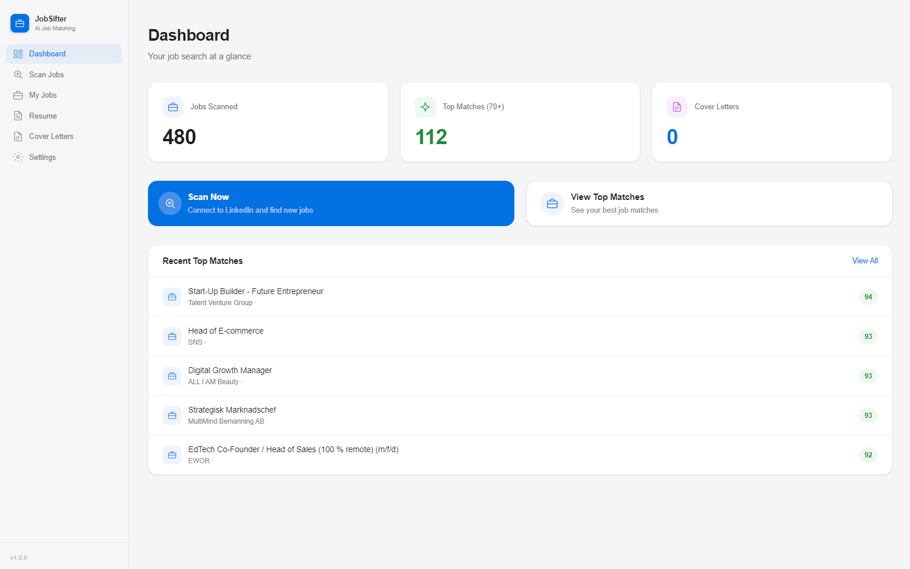

<p align="center">
  <h1 align="center">JobSifter</h1>
  <p align="center">
    <strong>Free &amp; open source (GPL-3.0)</strong> desktop app that uses AI to help you find your next job.<br>
    Stop wasting time on jobs you won't get. Focus on the ones that actually match you.
  </p>
  <p align="center">
    <a href="#features">Features</a> &middot;
    <a href="#getting-started">Getting Started</a> &middot;
    <a href="#architecture">Architecture</a> &middot;
    <a href="#contributing">Contributing</a> &middot;
    <a href="#license">License</a>
  </p>
</p>

---

## Why JobSifter?

Job searching sucks. You open listing after listing, read through walls of text, and most of them aren't even a good fit for you. You end up spending hours just browsing instead of actually applying to the right roles.

JobSifter was built to fix that. It does the tedious part for you:

- **Scans job listings from multiple platforms** - searches LinkedIn, Indeed, Platsbanken (Sweden), and RemoteOK automatically. No more manually clicking through pages of results
- **Tells you which jobs actually match you** - AI analyzes every job against your CV and gives you a match score, so you can skip the 30% matches and focus on the 85% ones
- **Generates cover letters from your real experience** - when you find a great match, AI writes a personalized cover letter based on your actual CV and the specific job description. No generic templates

The app is **100% free**, **open source** under the GPL-3.0 license, and runs entirely on your own computer. The only cost is the AI API usage from the provider you choose (Claude or OpenAI) using your own account - and the app shows you estimated costs before every scoring run so there are no surprises. Scoring 100 jobs typically costs between $0.04 and $0.69 depending on model. Your CV and data never leave your machine (except to the AI provider for analysis). No accounts with us, no subscriptions, no data collection.

## Download

Download the latest version for your platform:

| Platform | Download |
|----------|----------|
| Windows | [JobSifter-Setup-Windows.zip](https://github.com/markusj87/jobsifter/releases/latest/download/JobSifter-Setup-Windows.zip) |
| macOS (Intel) | [JobSifter-x64.dmg](https://github.com/markusj87/jobsifter/releases/latest/download/JobSifter-x64.dmg) |
| macOS (Apple Silicon) | [JobSifter-arm64.dmg](https://github.com/markusj87/jobsifter/releases/latest/download/JobSifter-arm64.dmg) |

> After downloading, you'll also need an API key from [Anthropic (Claude)](https://console.anthropic.com/) or [OpenAI](https://platform.openai.com/) for the AI features.

<details>
<summary><strong>macOS: First launch browser download</strong></summary>

On macOS, the first time you click "Connect" in Scan Jobs, the app will automatically download Chromium (~170MB). This takes about a minute and only happens once. You'll see the progress in the Scanner Log. On Windows, the browser is included in the installer.

If the automatic download fails, open Terminal and run:
```bash
cd /Applications/JobSifter.app/Contents/Resources/app.asar.unpacked/node_modules/playwright && npx playwright install chromium
```
Then restart the app.
</details>

<details>
<summary><strong>macOS: "App is damaged" warning (fork/self-built only)</strong></summary>

The official JobSifter downloads are **signed and notarized** with an Apple Developer certificate — they should open without any warnings.

If you built the app yourself from a fork or from source, macOS will block it since it won't be signed. To open it:

**Easy way:** Right-click (or Control-click) the app → click **Open** → click **Open** again in the dialog.

**If that doesn't work:** Open Terminal and run:
```bash
xattr -cr /Applications/JobSifter.app
```
Then open the app normally. This only needs to be done once.
</details>

## Features

### Job Sources

JobSifter supports four job platforms, each with its own tab in Scan Jobs:

| Source | Method | Auth Required | Speed |
|--------|--------|---------------|-------|
| **LinkedIn** | Browser automation | Yes (login) | ~100 jobs / 15 min |
| **Indeed** | Browser automation | No | ~100 jobs / 10 min |
| **Platsbanken** (Sweden) | Open REST API | No | Hundreds in seconds |
| **RemoteOK** | Public JSON API | No | All jobs in one call |

### Core Workflow
- **AI-Powered CV Parsing** - Upload a PDF resume and AI extracts your name, contact info, skills, experience, education, and generates a detailed candidate profile
- **Multi-Platform Job Scanning** - Scans LinkedIn, Indeed, Platsbanken, and RemoteOK. Each source has its own tab with source-specific search fields
- **Custom Search** - Search by keywords and location on any supported platform
- **AI Job Matching** - Analyzes each job against your CV with a 0-100 score, strengths, gaps, fit summary, and interview advice. Score all jobs at once or filter by source
- **Resume Feedback** - Get AI-powered feedback on your CV tailored to a specific role and company. From My Jobs you can get feedback based on the full job description, or from the Resume page by entering any role/company manually. All feedback is saved so you can revisit it anytime
- **Cover Letter Generation** - Creates personalized, natural-sounding cover letters that reference your actual experience
- **PDF Export** - Export cover letters as professionally formatted PDFs
- **Data Export/Import** - Transfer your jobs and settings between computers. API keys are excluded from exports for security
- **Dark Mode** - Apple-style dark/light theme toggle

### Technical Highlights
- **Pluggable Source Architecture** - Each job source implements a shared `JobSource` interface, making it easy to add new platforms
- **Batch AI Scoring** - Scores 10 jobs per API call, 5 calls in parallel = 50 jobs simultaneously. Filter by source to score selectively
- **Token Tracking** - Real-time token consumption and cost estimates during scoring
- **Incremental Scanning** - Skips already-scanned jobs, resumes where you left off
- **Session Persistence** - Browser login session saved to disk, no re-authentication needed
- **Offline Browsing** - All scanned jobs stored locally in SQLite, browse and filter without internet
- **Background Scanning** - Navigate the app freely while scanning continues. Active source tab shows a pulsing indicator
- **36 LinkedIn Categories** - Predefined categories covering all industries plus custom keyword search
- **Privacy First** - Zero telemetry, no servers, data only leaves your machine to your chosen AI provider

## Screenshots

[View all screenshots](SCREENSHOTS.md)



## Getting Started

### Prerequisites

| Requirement | Version |
|------------|---------|
| Node.js | 18+ |
| npm | 9+ |
| API Key | [Anthropic (Claude)](https://console.anthropic.com/) or [OpenAI](https://platform.openai.com/) |

### Installation

```bash
# Clone the repository
git clone https://github.com/markusj87/jobsifter.git
cd jobsifter

# Install dependencies (automatically rebuilds native modules for Electron)
npm install

# Install Chromium for browser automation
npx playwright install chromium
```

### Development

```bash
# Start in development mode with hot reload
npm run dev
```

### Build Installers

```bash
# Windows (.exe installer)
npm run dist:win

# macOS (.dmg)
npm run dist:mac

# All platforms
npm run dist
```

## How It Works

### Step-by-step

1. **Connect AI** - Go to Settings, select Claude or OpenAI, enter your API key, choose a model
2. **Upload CV** - Go to Resume, upload your PDF. AI parses it into structured data with a detailed candidate profile
3. **Scan Jobs** - Go to Scan Jobs, pick a source tab (LinkedIn, Indeed, Platsbanken, or RemoteOK), enter search criteria, hit Start Scan
4. **Review Matches** - Go to My Jobs, click Score All. Filter by source if needed. AI scores every job in parallel batches. Sort and filter by score
5. **Deep Dive** - Click any job to see full description, match analysis, strengths, gaps, and personalized interview advice. Score individual jobs directly from the detail page
6. **Resume Feedback** - Get AI feedback on how to improve your CV for a specific job. Available from My Jobs (uses full job description) or from the Resume page (manual entry)
7. **Apply** - Generate a cover letter, edit it, export as PDF

### Scanning Flow

```
User picks a source tab and clicks Start Scan
  |
  v
[LinkedIn / Indeed]              [Platsbanken / RemoteOK]
Playwright opens browser          HTTP API call (no browser)
  |                                |
  v                                v
For each page of results:        Fetch all results via pagination
  ├── Navigate / scroll            ├── Parse JSON response
  ├── Extract job cards            ├── For each job:
  ├── For each job:                |     ├── Skip if already in DB
  |     ├── Skip if in DB          |     └── Save to SQLite
  |     ├── Click to load detail   └── Return results
  |     ├── Extract description
  |     └── Save to SQLite
  ├── Next page
  └── Repeat
```

### AI Scoring Flow

```
User clicks Score All (optionally filtered by source)
  |
  v
Unscored jobs split into batches of 10
  |
  v
5 batches sent to AI in parallel (50 jobs at once)
  |
  v
Each batch returns: score, strengths, gaps, summary, chance, advice
  |
  v
Results saved to SQLite, UI updates progressively
```

## Architecture

### Tech Stack

| Layer | Technology |
|-------|-----------|
| Desktop Framework | Electron |
| Build Tool | electron-vite |
| Frontend | React 19 + TypeScript |
| Styling | Tailwind CSS v4 |
| Browser Automation | Playwright |
| Database | SQLite (better-sqlite3) |
| AI | Anthropic Claude SDK / OpenAI SDK |
| PDF Generation | Playwright page.pdf() |
| Installer | electron-builder |

### Project Structure

```
src/
  main/                          # Electron main process (Node.js)
    index.ts                     # App lifecycle, window management
    ipc-handlers/
      index.ts                   # Central IPC registration
      scan.ts                    # Multi-source scanning IPC
      jobs.ts                    # Job retrieval, scoring, management
      cv.ts                      # CV upload/parse/update
      settings.ts                # Settings + data export/import
      cover-letters.ts           # Cover letter CRUD + PDF export
      cv-feedback.ts             # Resume feedback generation
    sources/                     # Pluggable job source system
      types.ts                   # JobSource interface, SearchParams, RawJob
      registry.ts                # Source registry (getSource, getAllSources)
      linkedin/
        index.ts                 # LinkedIn source (browser, requires auth)
        scanner.ts               # LinkedIn scanning logic
        selectors.ts             # LinkedIn DOM selectors
      indeed/
        index.ts                 # Indeed source (browser, no auth)
        selectors.ts             # Indeed DOM selectors
      platsbanken/
        index.ts                 # Platsbanken source (REST API)
      remoteok/
        index.ts                 # RemoteOK source (JSON API)
    ai/
      ai-service.ts              # AI provider abstraction (Claude/OpenAI), token tracking
      prompts.ts                 # All AI prompt templates
      parse-ai-response.ts       # JSON parsing utilities
    browser/
      playwright-manager.ts      # Browser lifecycle, Chromium bundling, auto-install
      linkedin-auth.ts           # Session detection via cookies
      scanner.ts                 # Legacy LinkedIn scanner (used by source adapter)
      scroll-utils.ts            # Smart scrolling with job count detection
      selectors.ts               # LinkedIn DOM selectors
      extractor.ts               # Job detail extraction from DOM
      pagination.ts              # Page navigation
    database/
      database.ts                # SQLite connection, WAL mode, migrations
      migrations.ts              # Schema + migration from old linkedin_job_id format
      repositories/
        jobs.ts                  # Job CRUD, filtering by source, sorting, pagination
        cv.ts                    # CV upsert/get
        cover-letters.ts         # Cover letter CRUD
        settings.ts              # Key-value settings store
        cv-feedback.ts           # Resume feedback CRUD
    pdf/
      pdf-generator.ts           # HTML-to-PDF via headless Playwright
  preload/
    index.ts                     # Typed contextBridge API (renderer <-> main)
  renderer/                      # React frontend
    src/
      App.tsx                    # Root component, routing, theme provider
      components/
        ThemeProvider.tsx         # Dark/light mode context
        Toast.tsx                # Global notification system
        icons.tsx                # SVG icon components
        Dialog.tsx               # Modal dialog component
        layout/
          Sidebar.tsx            # Navigation sidebar with theme toggle
          MainLayout.tsx         # Page layout with drag region
        cv/
          CVUploader.tsx         # PDF upload + text paste
          CVPreview.tsx          # Editable CV data display
      pages/
        Dashboard.tsx            # Stats, quick actions, top matches
        ScanJobs.tsx             # 4-tab source selector, scan controls, logs
        MyJobs.tsx               # Job table with source column/filter, batch scoring
        JobDetail.tsx            # Job view, score button, match analysis
        Resume.tsx               # CV display, upload, edit
        ResumeFeedbackList.tsx   # Saved resume feedback list
        ResumeFeedbackDetail.tsx # Full AI feedback view
        CoverLetters.tsx         # Cover letter list
        CoverLetterEdit.tsx      # Cover letter editor + PDF export
        Settings.tsx             # AI config, data export/import
      styles/
        index.css                # Tailwind + Apple design system + dark theme
  shared/                        # Shared between main + renderer
    types.ts                     # TypeScript interfaces (Job with source/externalId)
    ipc.ts                       # IPC channel constants
    constants.ts                 # App config, job categories, scan defaults
```

### IPC Communication

The app uses Electron's contextBridge pattern for secure communication between the renderer (React) and main process (Node.js):

```
Renderer (React)  -->  window.api.jobs.scoreAll('platsbanken')
                            |
                       Preload (contextBridge)
                            |
                       ipcRenderer.invoke('jobs:score-all', 'platsbanken')
                            |
                       Main Process (ipcMain.handle)
                            |
                       AI Service + SQLite
                            |
                       Returns result to renderer
```

Progress events (scanning, scoring) use `webContents.send()` for real-time push updates.

### Database Schema

```sql
-- All scanned jobs with source tracking and match data
jobs (id, external_id, source, title, company, location, posted_date,
      easy_apply, job_url, description, category, match_score,
      match_data, scanned_at, is_bookmarked, is_hidden)

-- Parsed CV data (single row)
cv (id, raw_text, name, email, phone, location, summary,
    skills, experience, education, updated_at)

-- Generated cover letters linked to jobs
cover_letters (id, job_id, content, is_edited, created_at, updated_at)

-- AI resume feedback saved for each role/company
cv_feedback (id, job_title, company, feedback, created_at)

-- Key-value settings (API keys, model selection, preferences)
settings (key, value)
```

## Supported AI Models

### Anthropic Claude

| Model | Input $/MTok | Output $/MTok | Best For |
|-------|-------------|--------------|----------|
| Claude Sonnet 4.6 | $3.00 | $15.00 | Recommended - good balance |
| Claude Opus 4.6 | $5.00 | $25.00 | Most capable |
| Claude Sonnet 4.5 | $3.00 | $15.00 | Previous gen |
| Claude Opus 4.5 | $5.00 | $25.00 | Previous gen |
| Claude Sonnet 4 | $3.00 | $15.00 | Budget option |
| Claude Haiku 4.5 | $1.00 | $5.00 | Fastest, cheapest |

### OpenAI

| Model | Input $/MTok | Output $/MTok | Best For |
|-------|-------------|--------------|----------|
| GPT-5.4 | $2.50 | $15.00 | Latest flagship |
| GPT-5 Mini | $0.125 | $1.00 | Very fast, very cheap |
| GPT-5.3 | $1.75 | $14.00 | Previous flagship |
| o3 | $2.00 | $8.00 | Reasoning tasks |
| o3 Mini | $0.55 | $2.20 | Reasoning, budget |
| o4 Mini | $1.10 | $4.40 | Reasoning |
| GPT-4.1 | $3.00 | $12.00 | Stable |
| GPT-4.1 Mini | $0.80 | $3.20 | Budget |
| GPT-4.1 Nano | $0.20 | $0.80 | Cheapest |

*Pricing as of March 2026. The app shows cost estimates in Settings and before scoring.*

## Cost Estimates

Scoring 100 jobs typically uses ~110,000 tokens. Approximate costs:

| Model | Cost per 100 jobs |
|-------|-------------------|
| GPT-4.1 Nano | ~$0.04 |
| GPT-5 Mini | ~$0.04 |
| Claude Haiku 4.5 | ~$0.23 |
| Claude Sonnet 4.6 | ~$0.69 |
| GPT-5.4 | ~$0.65 |

## Contributing

Contributions are welcome! Please:

1. Fork the repository
2. Create a feature branch (`git checkout -b feature/my-feature`)
3. Commit your changes (`git commit -m 'Add my feature'`)
4. Push to the branch (`git push origin feature/my-feature`)
5. Open a Pull Request

### Development Notes

- **Adding a New Job Source** - Implement the `JobSource` interface in `src/main/sources/`, register it in `registry.ts`, and add a tab in `ScanJobs.tsx`
- **DOM Selectors** - Selectors are centralized per source (e.g. `src/main/sources/indeed/selectors.ts`). If scanning breaks due to website changes, update the relevant selectors file
- **AI Prompts** - All prompt templates are in `src/main/ai/prompts.ts`. Easy to tune and improve
- **Adding Models** - Model definitions with pricing are in `src/main/ai/ai-service.ts`

## Disclaimer

JobSifter is a personal productivity tool. All data is stored locally on your machine. You are solely responsible for complying with the terms of service of any third-party platforms you use with this tool. The developers accept no liability for how this software is used. Use responsibly and respect platform rate limits.

## License

This project is licensed under the **GNU General Public License v3.0** - see the [LICENSE](LICENSE) file for details.

You are free to use, modify, and distribute this software. Any derivative work must also be distributed under GPL-3.0 as open source.

---

<p align="center">
  Built with Electron, React, and AI.<br>
  <a href="https://github.com/markusj87/jobsifter/issues">Report Bug</a> &middot;
  <a href="https://github.com/markusj87/jobsifter/issues">Request Feature</a>
</p>
