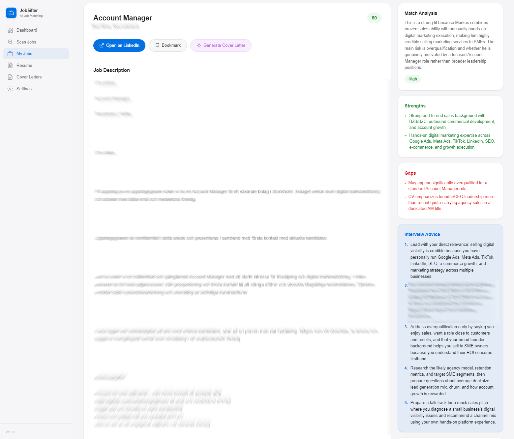
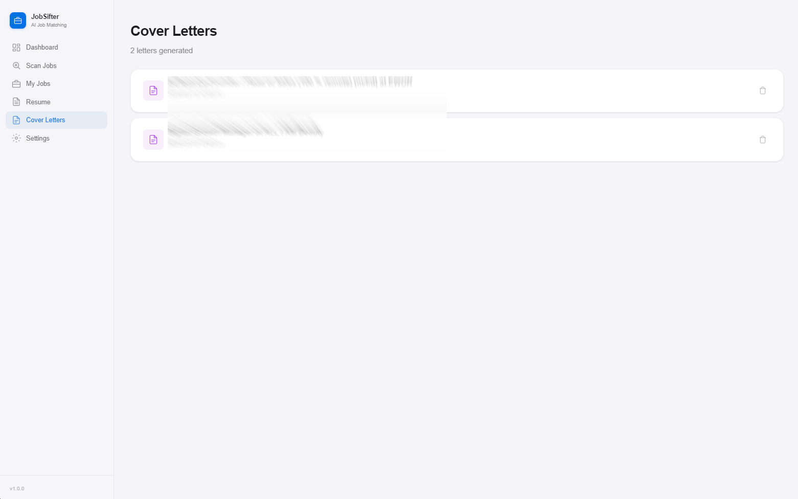

# JobSifter Screenshots

## Dashboard
Overview with stats, quick actions, and top matches.

## Scan Jobs
Connect browser, add custom searches, select categories, and scan with real-time progress and logs.

## Resume - AI Parsed CV
Your uploaded CV analyzed by AI, showing candidate profile, skills, experience, and education in a two-column layout.

## My Jobs
All scanned jobs in a sortable, filterable table. Score individually or batch score with AI.

## Job Details & Match Analysis
Full job description with AI-generated match score, strengths, gaps, and personalized interview advice.

## Cover Letters
List of all generated cover letters.

## Resume Feedback
AI-generated feedback on your CV tailored to a specific role and company. Available from My Jobs (using the full job description) or from the Resume page by entering any role and company manually.

## Generated Cover Letter
AI-generated cover letter based on your CV and the job description. Edit and export as PDF.

